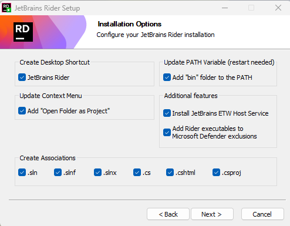
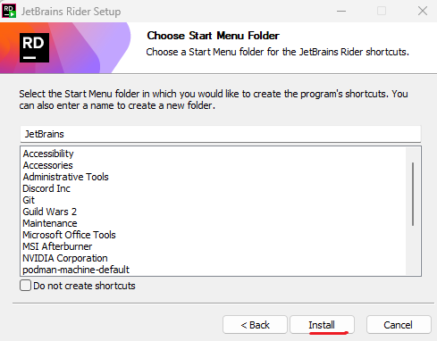
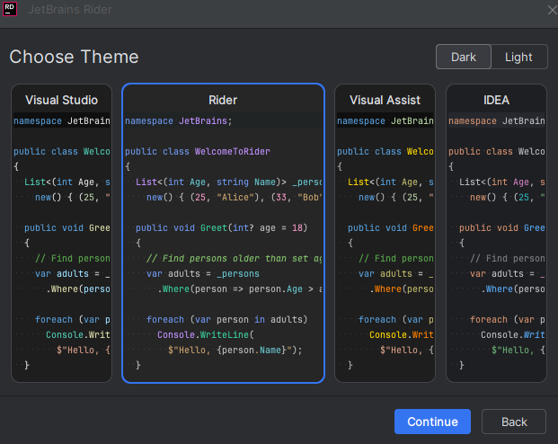
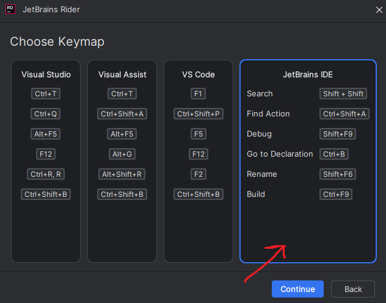
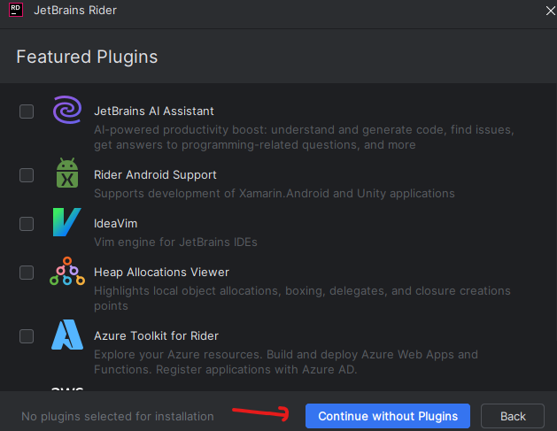

1. გადმოწერეთ .NET 8 & .NET 9 [აქედან](https://dotnet.microsoft.com/en-us/download) 
2. დააინსტალირეთ სტანდარტულად (next, next, next ...)
3. გადმოწერეთ ედიტორი [Rider](https://www.jetbrains.com/rider/download/?section=windows)
   * როცა ინსტალაციის ამ ეტაპამდე მიხვალთ მონიშნეთ შემდეგი option ები:  
   
   * შემდეგ ვიწყებთ ინსტალაციას  
   
   * როცა ინსტალაცია დასრულდება გაუშვით rider. პირველ გაშვებაზე აირჩიეთ თქვენთვის მოსახერხებელი თემა:  
   
   * შორთქათების კონფიგურაციის არჩევისას აირჩიეთ Jetbrains IDE შორთქათები:  
   
   * დაასრულეთ ინსტალაცია:  
   